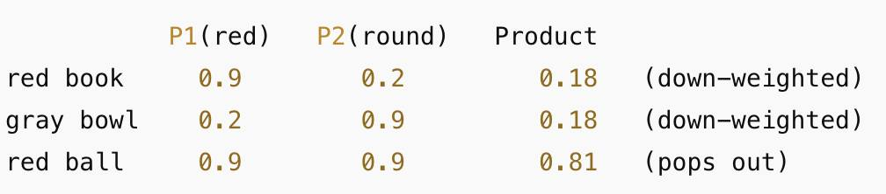
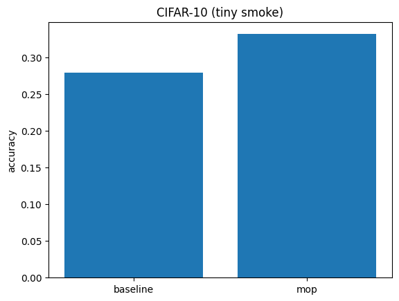

# MoP: Mixture of Products for Transformers

---
🧠 Bringing Boolean Logic to the Age of Transformers 🚀

MoP: Where spatial reasoning meets neural architecture

---
[](https://github.com/Eran-BA/MoP/releases/latest)
[](https://github.com/Eran-BA/MoP/actions)
[](https://www.python.org/downloads/)
[](https://pytorch.org/)
[](https://opensource.org/license/apache-2-0)
[](https://orcid.org/0009-0005-5186-5594)

## Overview
## Install
*Requires Python 3.9+*

```bash
git clone https://github.com/Eran-BA/MoP.git
cd MoP
pip install -r requirements.txt
# optional: quick self-test
pytest -q
```
<!-- moved A/B/C example to experiments/README.md -->
#### Quickstart: CIFAR-100 A/B/E/E+ (smoke run)
Colab-friendly one cell to run A, B, E (neutral) and E+ (mix5) at ~5M.
```bash
!python experiments/cifar100_ab5_param_budgets.py \
  --targets 5000000 --models A B E \
  --steps 3000 --eval_every 500 --batch 256 \
  --val_frac 0.1 --val_seed 0 \
  --lr 0.003 --warmup_frac 0.1 --weight_decay 0.05 --lr_e 0.0007 \
  --ew_views 5 --ew_use_k3 --ew_share_qkv --ew_mlp_ratio 3.0 \
  --ew_variants lowrank:neutral lowrank:mix5 --ew_gate_rank 4 \
  --seeds 0 --plot --out results/ab5_cifar100_5m/quick_A_B_E_Emix5
```


##### expected (sanity): MoP ≥ baseline by ~1–3pp on short runs; see full results below.

---


> **Project status (2025-08-17):** Research prototype. The `main` branch implements **ViT-MoP**, and research implementations of **GPT-MoP** and **Whisper-MoP** are included. Reported metrics here are tiny-smoke sanity checks and **not** conclusive.

MoP introduces spatial boolean logic into Transformers through a novel **Mixture of Products** mechanism. It operates in the attention score-space: learn excitatory/inhibitory gates that mix per-edge QK score maps (or their softmaxes) to realize boolean operations like AND, OR, and NOT over attention maps, before value aggregation (then re-mask and re-normalize).

The MoP mechanism is **architecture-agnostic** and has been successfully implemented across multiple modalities:
- **Vision Transformers (ViT)** - Spatial reasoning for images ✅ *Implemented* — see [`mop/models/vit_baseline.py`](mop/models/vit_baseline.py) and [`mop/models/vit_mop.py`](mop/models/vit_mop.py)
- **GPT Models** - Sequential token interactions with Quartet Attention ✅ *Implemented (research)* — see [`mop/models/gpt_mop.py`](mop/models/gpt_mop.py)
- **Audio Transformers (Whisper)** - Temporal-spectral patterns ✅ *Implemented (research)* — see [`mop/models/whisper_mop.py`](mop/models/whisper_mop.py)
- **Any Transformer Architecture** - General feature gating 🔮 *Extensible*

### Key Features

- 🧠 **Universal Boolean Logic**: Learn AND/OR/NOT operations across different modalities
- 🔧 **Architecture-Agnostic**: Successfully implemented for ViT, GPT, and Whisper
- 📊 **Parameter-Matched Comparisons**: Fair evaluation with identical parameter counts
- 🎯 **Multiple Domains**: Vision (CIFAR-10/100), Language (GPT), Audio (Whisper)
- 🔬 **Research-Ready**: Complete experimental framework and statistical testing
- 📈 **Reproducible**: Deterministic training with multiple random seeds
- 🎵 **Audio Processing**: 2D spectrogram analysis with temporal-spectral patterns
- 📝 **Language Modeling**: Enhanced attention with Quartet mechanism

## Architecture

The MoP mechanism extends Transformers with:

1. **Multi-view Projections**: Transform token embeddings into multiple feature views
2. **Learnable Kernels**: Convolutional filters for spatial/temporal pattern detection  
3. **Excitatory/Inhibitory Fusion**: Gating mechanism enabling boolean logic operations
4. **Token Modulation**: Apply learned gates to modulate transformer token representations

```
Input → Transformer Encoder → [Views + Kernels] → Exc/Inh Gates → Modulated Tokens → Output
```

### Quartet Attention Architecture

Our GPT-MoP implementation features the **Quartet Attention** mechanism, which extends standard scaled dot-product attention with dual-path processing:


### Mixture Cookbook

#### Token example — object tokens

<p align="left">
  
  <br/>
  <sub>Conjunction via product: normalize(A₁ ⊙ A₂) ≡ softmax(S₁ + S₂).</sub>
</p>


A tiny, synthetic sequence with three **key tokens**: **red_book**, **gray_bowl**, **red_ball**.  
We form two attention *views* for the **same query row** \(i\):

- **A₁ (color/red)** — prefers red things.
- **A₂ (shape/round)** — prefers round things.

**Table 1 — A₁ and A₂ for the same row \(i\)**
| query \(i\) \ keys \(j\) | red_book | gray_bowl | red_ball |
|---|---:|---:|---:|
| A₁ (red)   | 0.50 | 0.10 | 0.40 |
| A₂ (round) | 0.10 | 0.50 | 0.40 |

**Table 2 — AND (element-wise product) and row-normalize**
| query \(i\) \ keys \(j\) | red_book | gray_bowl | red_ball |
|---|---:|---:|---:|
| AND raw = A₁·A₂ | 0.05 | 0.05 | 0.16 |
| AND normalized  | **0.185** | **0.185** | **0.630** |

Result: **red_ball** (red ∧ round) pops; *only-red* (**red_book**) and *only-round* (**gray_bowl**) are down-weighted.

> Identity: in score-space, `AND` is just `softmax(S1 + S2)`. In probability space, multiply then renormalize.

This section makes MoP’s **mixtures** concrete. It lists the main operators you can compose over **dual-path** (or multi-path) attention maps and gives a tiny, drop-in API.

#### Notation & Shapes
- Per head, pre-softmax scores: `S ∈ R[T×T]` (same mask/causality).
- Two views (extendable to M): `S1 = Q1 K1ᵀ`, `S2 = Q2 K2ᵀ`.  
  Post-softmax: `A1 = softmax(S1)`, `A2 = softmax(S2)` (row-stochastic).
- We always **re-mask** before softmax if needed.

#### Core Operators
All operators are per head and preserve causal masking when inputs do.

- **AND (conjunction / precision)**  
  Probability-space: `normalize(A1 ⊙ A2)`  
  Score-space identity: `softmax(S1 + S2)`

- **OR (recall)**  
  Probability-space: `normalize(exp(S1) + exp(S2))`  
  Score-space (soft-OR): `softmax(LSE(S1, S2))` where `LSE(a,b)=log(exp a + exp b)`

- **NOT / exclusion (suppress distractors)**  
  `softmax(S1 − β·S2)` with learnable `β ≥ 0` (defaults small).

- **XOR / disagreement (optional)**  
  `softmax(|S1 − S2|)` or `A1 + A2 − 2·A1⊙A2` (then renormalize).

- **Two-hop composition (relational chaining via k)**  
  `C→ = A1 @ A2`, `C← = A2 @ A1` (row-stochastic). This routes evidence `i→k→j` instead of intersecting at the same `(i,j)`.

- **Per-key prior (edge sharpening with a chosen k\*)**  
  For a specific anchor row `k*` from view-2:  
  `Asharp(i,j) ∝ A1(i,j) · A2(k*, j)` (then normalize the row `i`).

- **Cross-view binding (query of one view vs key of the other)**  
  Extra score paths: `S12 = Q1 K2ᵀ`, `S21 = Q2 K1ᵀ`.  
  General 2×2 mixer: `[Q1,Q2] · M · [K1;K2]ᵀ` with a tiny learnable `M`.

- **Transpose channels (key-centric cues)**  
  Include `S1ᵀ, S2ᵀ` as channels so the mixer can use **column** context at `(i,j)`.

> Tip: In probability-space, `AND` = multiply then renormalize. In score-space, it’s **just add the logits** (`S1+S2`).

#### Tiny Drop-In Mixer (PyTorch)
```python
import torch
from torch.nn import functional as F

def lse(a, b):
    return torch.logsumexp(torch.stack([a, b], dim=0), dim=0)

def dual_path_mix(S1, S2, mask=None, beta_not=0.5, gates=None):
    """
    S1, S2: [B, H, T, T] pre-softmax scores (same mask/temperature)
    mask:   [B, 1, 1, T] or [B, 1, T, T] with 0 for disallowed keys
    gates:  optional dict of scalars in [0,1] to weight ops (defaults provided)
    """
    if gates is None:
        gates = dict(and_=1.0, or_=0.0, not_=0.0, chain=0.0, base=1.0)
    # Base path
    Smix = gates["base"] * (S1 + 0.0)
    # AND (sum of logits)
    Smix = Smix + gates["and_"] * ((S1 + S2) - S1)
    # OR (soft-OR)
    Smix = Smix + gates["or_"] * (lse(S1, S2) - S1)
    # NOT (exclusion)
    Smix = Smix - gates["not_"] * (beta_not * S2)
    # Two-hop (i→k→j) via A1@A2; add as log-prob
    A1 = F.softmax(S1.masked_fill((mask==0) if mask is not None else False, float("-inf")), dim=-1)
    A2 = F.softmax(S2.masked_fill((mask==0) if mask is not None else False, float("-inf")), dim=-1)
    C_right = torch.matmul(A1, A2)  # [B,H,T,T]
    eps = 1e-6
    Smix = Smix + gates["chain"] * torch.log(C_right + eps)
    # Re-mask and softmax
    if mask is not None:
        Smix = Smix.masked_fill((mask==0), float("-inf"))
    return F.softmax(Smix, dim=-1)
```
#### CNN-Gated Variant (edge-wise selection)
Treat each map as a **channel** over the (i,j) grid and predict per-edge gates:

- **Inputs (per head):** `[S1, S2, S1ᵀ, S2ᵀ, log(C→+ε), log(C←+ε)]`
- **Head:** depthwise/pointwise `1×1` + `3×3`; initialize gate logits ≈ **−5** so you begin near the base path.
- **Outputs:** `g_and, g_or, g_not, g_chain ∈ [0,1]^{T×T}`; mix as in the code, re-mask, then softmax.


**Key Innovations:**
- **Dual-Path Processing**: Parallel QK and Q2K2 attention score calculations
- **Learnable Mixing**: Gate-controlled combination of normalized attention scores
- **Enhanced Expressiveness**: Captures more complex token interaction patterns
- **Parameter Efficiency**: Maintains similar parameter count to baseline

**Current Implementation:**
- **Vision**: Spatial attention over image patches (8×8 grid for CIFAR)
- **Language**: Sequential attention with Quartet mechanism for token interactions
- **Audio**: Temporal-spectral attention with 2D convolutions
- **Boolean Operations**: Learnable AND/OR/NOT combinations via excitatory/inhibitory gating

**Future Applications:**
- **Multimodal**: Cross-modal attention mechanisms
- **Real-time**: Streaming attention for live data processing
- **Specialized**: Domain-specific attention patterns

## Installation

### Quick Install
```bash
git clone https://github.com/Eran-BA/MoP.git
cd MoP
pip install -r requirements.txt
```

### Development Install
```bash
git clone https://github.com/Eran-BA/MoP.git
cd MoP
pip install -e .
```

### Verify Installation
```bash
!pytest
!python experiments/cifar10_multi_seed.py --tiny --steps 400 --eval_every 100 --seeds 0
```

### Tiny smoke run
```bash
!python experiments/cifar10_multi_seed.py --tiny --steps 400 --eval_every 100 --seeds 0
```
The smoke script auto-detects your device (`cuda`/`mps`/`cpu`) and writes a CSV to `results/cifar10/cifar10_acc.csv`.

## Implementations

### 🖼️ Vision Transformers (ViT-MoP)
**Spatial Boolean Logic for Image Processing**
- **Application**: CIFAR-10/100 image classification
- **MoP Components**: `ViewsLinear`, `Kernels3`, `FuseExcInh`
- **Pattern Detection**: 8×8 spatial grid analysis
- **Boolean Operations**: AND/OR/NOT over image patches

```python
from mop.models import ViT_MoP, ViT_Baseline

# Create parameter-matched models
baseline = ViT_Baseline(dim=256, depth=6, heads=4, n_classes=10)
mop_model = ViT_MoP(dim=256, depth=6, heads=4, n_classes=10, 
                    n_views=5, n_kernels=3)

# Extract spatial attention patterns
gates, views, kernels = mop_model.get_gate_maps(x)
```

### 📝 Language Models (GPT-MoP)
*Status: implemented (research)* — see [`mop/models/gpt_mop.py`](mop/models/gpt_mop.py)
**Sequential Boolean Logic with Quartet Attention**
- **Application**: Character-level language modeling
- **MoP Components**: `ViewsLinear1D`, `Kernels1D`, `FuseExcInh1D`
- **Pattern Detection**: Temporal token interactions
- **Enhanced Attention**: Dual-path QK processing with learnable mixing

```python
from mop.models import GPT_MoP, create_gpt_mop

# Create GPT-MoP with Quartet attention
config = TransformerConfig(n_layer=6, n_head=8, n_embd=256)
mop_model = create_gpt_mop(vocab_size=1000, config=config, n_views=5, n_kernels=3)

# Forward pass with MoP-enhanced attention
logits, loss = mop_model(x, targets=y)
```

### 🎵 Audio Transformers (Whisper-MoP)
*Status: implemented (research)* — see [`mop/models/whisper_mop.py`](mop/models/whisper_mop.py)
**Temporal-Spectral Boolean Logic for Audio Processing**
- **Application**: Audio transcription and understanding
- **MoP Components**: `ViewsConv2D`, `Kernels2D`, `FuseExcInh2D`
- **Pattern Detection**: 2D spectrogram analysis (time × frequency)
- **Architecture**: Encoder-decoder with MoP gating in encoder

```python
from mop.models import WhisperMoP, create_whisper_mop

# Create Whisper-MoP for audio processing
config = WhisperConfig(n_layer_enc=6, n_layer_dec=6, n_embd=512, n_mels=80)
mop_model = create_whisper_mop(config)

# Process mel spectrograms with MoP gating
logits, loss, gates = mop_model(mel, dec_input_ids, targets=targets)
```

## Quick Start

### Basic Usage

```python
import torch
from mop import ViT_MoP, ViT_Baseline

# Create models with matched parameter counts
baseline = ViT_Baseline(dim=256, depth=6, heads=4, n_classes=10)
mop_model = ViT_MoP(dim=256, depth=6, heads=4, n_classes=10, 
                    n_views=5, n_kernels=3)

# Forward pass
x = torch.randn(32, 3, 32, 32)  # CIFAR-10 batch
logits_baseline = baseline(x)   # (32, 10)
logits_mop = mop_model(x)       # (32, 10)

# Extract spatial attention patterns
gates, views, kernels = mop_model.get_gate_maps(x)
print(f"Gates shape: {gates.shape}")    # (32, 1, 8, 8)
print(f"Views shape: {views.shape}")    # (32, 5, 8, 8)  
print(f"Kernels shape: {kernels.shape}") # (32, 3, 8, 8)
```

### Parameter Matching

```python
def count_params(model):
    return sum(p.numel() for p in model.parameters() if p.requires_grad)

print(f"Baseline: {count_params(baseline):,} parameters")
print(f"MoP: {count_params(mop_model):,} parameters")
# Output: Nearly identical parameter counts for fair comparison
```

### Sanity Check (Tiny CIFAR-10 smoke)
Quick subset run to validate wiring and get a rough A/B signal:

### Smoke run: CIFAR‑100 A/B/E/E+ (~5M params)
Colab-friendly cell to run A, B, E (neutral), and E+ (mix5) together at ~5M.
```bash
!python experiments/cifar100_ab5_param_budgets.py \
  --targets 5000000 --models A B E \
  --steps 3000 --eval_every 500 --batch 256 \
  --val_frac 0.1 --val_seed 0 \
  --lr 0.003 --warmup_frac 0.1 --weight_decay 0.05 --lr_e 0.0007 \
  --ew_views 5 --ew_use_k3 --ew_share_qkv --ew_mlp_ratio 3.0 \
  --ew_variants lowrank:neutral lowrank:mix5 --ew_gate_rank 4 \
  --seeds 0 --plot --out results/ab5_cifar100_5m/smoke_A_B_E_Emix5
```

| setting | baseline | MoP |
|--------:|:--------:|:---:|
| CIFAR-10 (tiny smoke) | 0.279 | 0.332 |

<p align="center">
  
</p>


## Results

### Sanity check (tiny smoke)

- **CIFAR-10 (1 seed, ~400 steps, no heavy aug):** baseline **27.9%** → MoP **33.2%** (**+5.3 pp**). This is a *wiring sanity check*, **not** a converged result. Full runs with multiple seeds & statistics are planned.

## Core Components

### MoP Components (Architecture-Agnostic)

```python
from mop.models import ViewsLinear, Kernels3, FuseExcInh

# Multi-view projection (any sequence length)
views = ViewsLinear(dim=256, n_views=5)

# Learnable pattern detection (adaptable kernel sizes)  
kernels = Kernels3(in_ch=5, n_kernels=3)

# Boolean logic fusion (excitatory/inhibitory)
fusion = FuseExcInh(in_ch=8)  # 5 views + 3 kernels
```

### Transformer Components (Reusable)

```python
from mop.models import ViTEncoder, PatchEmbed, MSA, MLP, Block

# Standard transformer building blocks
# Can be adapted for other architectures (GPT, etc.)
```

## Experiments

*Note:* **CIFAR-10 smoke training script is included** under `experiments/`. CIFAR-100 and ablations are marked as planned.

### CIFAR-10 Smoke Run
```bash
!python experiments/cifar10_multi_seed.py --tiny --steps 400 --eval_every 100 --seeds 0 --out results/cifar10
```

### Two-hop (value-aware) quick starts
```bash
# CIFAR-10 two-hop, param-matched ~5M
!python experiments/cifar10_twohop_param_budgets.py --targets 5000000 --seeds 0 1 --steps 1000

# CIFAR-100 two-hop, param-matched ~5M
!python experiments/cifar100_twohop_param_budgets.py --targets 5000000 --seeds 0 1 --steps 1500

# Optional: direct two-hop gates (CIFAR-10)
!python experiments/cifar10_twohop_gates.py --steps 1000 --seeds 0 1 --gate_chain 1.0

# Optional: direct two-hop gates (CIFAR-100)
!python experiments/cifar100_twohop_gates.py --steps 1500 --seeds 0 1 --gate_chain 1.0
```

### CIFAR-100 with Augmentation (Planned)
```bash
!python experiments/cifar100_augmented.py --seeds 0 1 2 --output results/cifar100
```

### A/B/C/D/E on CIFAR-100 (param-matched)
Colab-friendly examples. Use a smaller `--batch` if you hit OOM on MPS/Colab.

```bash
!python experiments/cifar100_ab5_param_budgets.py --targets 5000000 --seeds 0 1 --steps 1500 \
  --models A B C D E \
  --xview_transpose --xview_t1 0.2 --xview_t2 0.2 --xview_enable_prior --xview_prior_weight 0.5 \
  --xview_anchor_mode argmax_row_sum --mh_hops 3 --mh_gate_chain 1.0

!python experiments/cifar100_ab5_param_budgets.py --targets 50000000 --seeds 0 1 --steps 1500 \
  --models A B C D E --batch 64 \
  --ew_views 5 --ew_use_k3 --ew_share_qkv --debug_budget \
  --xview_transpose --xview_t1 0.2 --xview_t2 0.2 --xview_enable_prior --xview_prior_weight 0.5 \
  --xview_anchor_mode argmax_row_sum --mh_hops 3 --mh_gate_chain 1.0
```

### ImageNet A/B/E (param-matched, paper-style aug)
```bash
# ViT-B/16 (~86M) and ViT-L/16 (~307M)
!python experiments/imagenet_ab_param_budgets.py \
  --data_root /path/to/imagenet \
  --targets 86000000 307000000 \
  --models A B E \
  --img_size 224 --patch 16 \
  --steps 90000 --eval_every 1000 --batch 256 \
  --lr_large 0.001 --warmup_frac 0.1 --weight_decay 0.1 \
  --use_randaug --randaug_n 2 --randaug_m 9 --random_erasing 0.25 \
  --mixup_alpha 0.8 --cutmix_alpha 1.0 --mix_prob 0.5 \
  --drop_path 0.4 --grad_clip 1.0 --ema --ema_decay 0.9999 \
  --ew_views 5 --ew_use_k3 --ew_share_qkv --ew_mlp_ratio 4.0 \
  --ew_variants lowrank:neutral lowrank:mix5 --ew_gate_rank 4 --lr_e 0.0007

# ViT-H/14 (~632M)
!python experiments/imagenet_ab_param_budgets.py \
  --data_root /path/to/imagenet \
  --targets 632000000 \
  --models A B E \
  --img_size 224 --patch 14 \
  --steps 90000 --eval_every 1000 --batch 256 \
  --lr_large 0.001 --warmup_frac 0.1 --weight_decay 0.1 \
  --use_randaug --randaug_n 2 --randaug_m 9 --random_erasing 0.25 \
  --mixup_alpha 0.8 --cutmix_alpha 1.0 --mix_prob 0.5 \
  --drop_path 0.4 --grad_clip 1.0 --ema --ema_decay 0.9999 \
  --ew_views 5 --ew_use_k3 --ew_share_qkv --ew_mlp_ratio 4.0 \
  --ew_variants lowrank:neutral lowrank:mix5 --ew_gate_rank 4 --lr_e 0.0007
```

### Paper tables
```bash
!python experiments/ab5_paper_benchmark.py
# writes results/paper_benchmark/ab5_benchmark.md and .tex
```

#### Developer: Unified Multi-Head Attention
Use `mop.models.UnifiedMSA` to instantiate attention variants directly inside a block:
```python
from mop.models import UnifiedMSA
attn = UnifiedMSA(mode="C", dim=256, heads=4, use_transpose_cues=True, t1=0.2, t2=0.2)
```

### Multi-Head MoP Attention
MoP is supported inside multi-head attention via `UnifiedMSA` (mode "E" for Edgewise; mode "D" for Multi-Hop). Gates are learned per head over QK score maps with multi-view composition.

```python
from mop.models import UnifiedMSA

# Example: multi-head Edgewise MoP attention (low-rank gates with preset mix)
attn = UnifiedMSA(
    mode="E",           # A/B/C/D/E
    dim=256,
    heads=6,
    n_views=5,
    use_k3=True,
    share_qkv=True,
    gate_mode="lowrank",  # or "dense"
    gate_rank=4,
    gate_init="mix5",     # neutral|and|or|not|nor|xor|chain|mix5
)
```
Key properties:
- Per-head, per-edge gates over QK score-space
- Multi-view composition with AND/OR/NOT/CHAIN channels
- Dense or low-rank gate parameterizations; preset-biased initializations

### Ablation Studies (Planned)
```bash
!python experiments/ablation_study.py --variants full views_only kernels_only no_gate
```

## Visualization

*Visualization utilities coming soon!*

```python
# Planned functionality:
from mop.visualization import visualize_gates

gates, views, kernels = model.get_gate_maps(images)
visualize_gates(images=images, gates=gates, views=views, 
                save_path='outputs/attention_maps.png')
```

## Extending to Other Architectures

MoP is architecture-agnostic and already has research implementations beyond ViT:

- GPT-MoP (language): see [`mop/models/gpt_mop.py`](mop/models/gpt_mop.py)
- Whisper-MoP (audio): see [`mop/models/whisper_mop.py`](mop/models/whisper_mop.py)

## Contributing

Contributions are welcome! Areas of particular interest:

### High Priority
- **Training Scripts**: CIFAR-10/100 experiment implementations
- **Utility Functions**: Parameter matching, statistical testing
- **GPT Extension**: Apply MoP to language models
- **Whisper Extension**: Apply MoP to audio transformers

### Contributing Process
1. Fork the repository
2. Create a feature branch (`git checkout -b feature/amazing-feature`)
3. Commit your changes (`git commit -m 'Add amazing feature'`)
4. Push to the branch (`git push origin feature/amazing-feature`)
5. Open a Pull Request

See [CONTRIBUTING.md](CONTRIBUTING.md) for detailed guidelines.

## Citation

If you use MoP in your research, please cite:

```bibtex
@misc{benartzy2025mop,
  title={MoP: Mixture of Products for Transformers - Spatial Boolean Logic for Neural Networks},
  author={Ben Artzy, Eran},
  year={2025},
  url={https://github.com/Eran-BA/MoP},
  note={ORCID: 0009-0005-5186-5594}
}
```

## License

This project is licensed under the Apache-2.0 License - see the [LICENSE](LICENSE) file for details.

## Roadmap

### ✅ Phase 1: Core Implementation (Current)
- [x] MoP mechanism implementation
- [x] ViT integration and baseline
- [x] Parameter matching utilities
- [x] Basic visualization support

### 🔄 Phase 2: Experimental Framework (In Progress)
- [ ] CIFAR-10/100 training scripts
- [ ] Statistical significance testing
- [ ] Comprehensive ablation studies
- [ ] Advanced visualization tools

### 🔮 Phase 3: Multi-Domain Expansion (Research)
- [x] GPT-MoP for language modeling — see [`mop/models/gpt_mop.py`](mop/models/gpt_mop.py)
- [x] Whisper-MoP for audio processing — see [`mop/models/whisper_mop.py`](mop/models/whisper_mop.py)
- [ ] Multimodal applications
- [ ] Theoretical analysis of boolean operations

### 📈 Phase 4: Research & Publication
- [ ] Comprehensive benchmark across domains
- [ ] Theoretical foundations paper
- [ ] Conference submissions (NeurIPS, ICML, ICLR)
- [ ] Community adoption and feedback


### What's Next:
- [ ] Filter-Bank Mixture-of-Products
- [ ] Generalize to a lens bank via (optionally causal) depthwise convs over Q/K(1…M); run CNN filters in parallel over the bank; support gate-free log-space multiplication. (Partially supported: conv over stacked score channels and log-space ops; Q/K depthwise pending)
- [ ] Multi-scale kernels with varying dilations
- [x] Parallel CNN over a bank of score/lens channels (Edgewise gate head over [Sᵢ, Sᵢᵀ, log C→, log C←])
- [x] Gate-free log-space mixing (score-space addition S₁+S₂; log chain terms)
- [x] Multi-head MoP attention via `UnifiedMSA` (modes D/E)


## Contact & Collaboration

**Eran Ben Artzy**
- ORCID: [0009-0005-5186-5594](https://orcid.org/0009-0005-5186-5594)
- LinkedIn: [eran-ben-artzy](https://linkedin.com/in/eran-ben-artzy)
- GitHub: [@Eran-BA](https://github.com/Eran-BA)

---

*For questions, issues, or collaboration opportunities, please open an issue or reach out through the channels above.*

**Please ensure proper citation when using this work in your research.**

---

#### Why not “just more heads”?
Multi-head averages outputs of separate softmaxes. MoP mixtures **change score geometry** (e.g., `S1+S2`, `S1−βS2`, cross terms, two-hop), enabling **conjunction, exclusion, and relational chaining** in one layer.

---
<div align="center">


**🧠 Bringing Boolean Logic to the Age of Transformers 🚀**

*MoP: Where spatial reasoning meets neural architecture*

</div>
